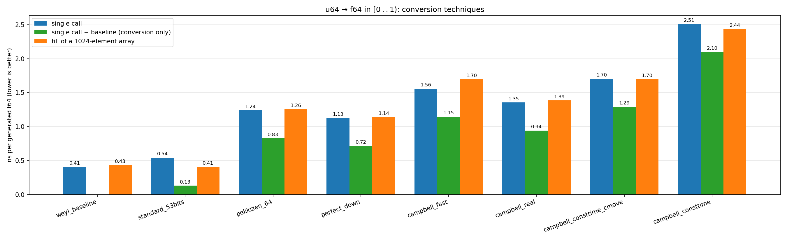
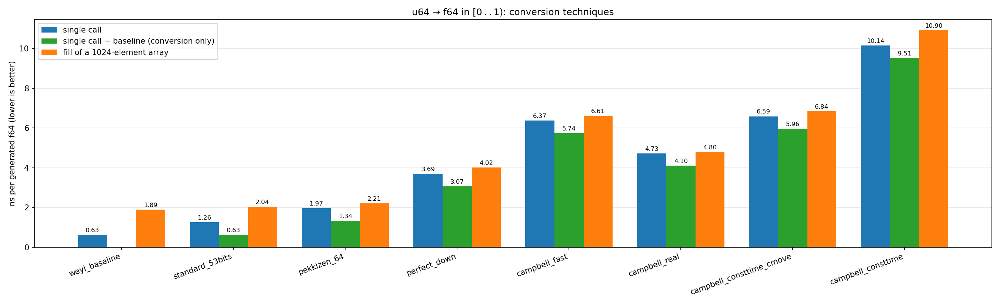
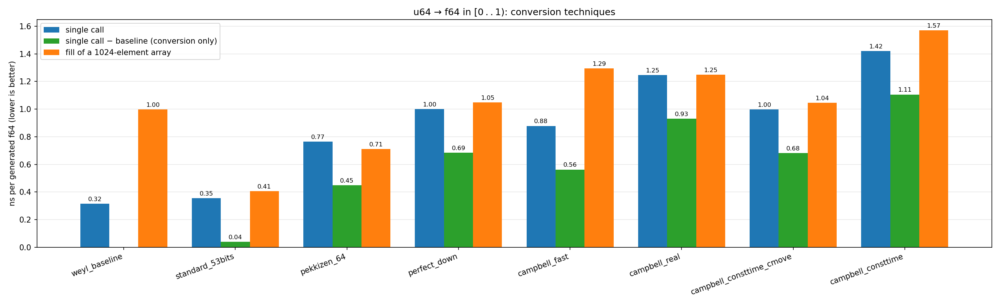

# rand-float-rs

This crate implements several techniques for generating uniform random
floating-point numbers in [0 . . 1) from a stream of random bits.

The motivation was the state of disarray of the literature on the topic:
academic papers, GitHub repositories, and free-floating sources, often lacking
comparison with other approaches, a few bugs, a in some cases definitely hostile
notation.

Every technique is implemented as a pure transformation of a source of
uniform random 64-bit words (any `FnMut() -> u64`), documented with its
exact output distribution, and benchmarked against the others.

The translation from the sources in different languages was operated by Fable
and extensively checked against the original implementation. In the process, we
isolated a few bugs in the original code, that have been reported to the
authors.

| Module              | Origin                                                                                        | Distribution                                     | Reachable values                                               | Words per `f64`      |
| ------------------- | --------------------------------------------------------------------------------------------- | ------------------------------------------------ | -------------------------------------------------------------- | -------------------- |
| `standard`          | folklore                                                                                      | equispaced                                       | the 2⁵³ multiples of 2⁻⁵³ in [0 . . 1)                         | 1                    |
| `pekkizen`          | [pekkizen's uniFloats](https://github.com/pekkizen/prng/wiki/uniFloats) (`Float64_64`)        | uniform real rounded down to a 2⁻⁶⁴ grid         | every float in [2⁻¹² . . 1); 2⁵² values spaced 2⁻⁶⁴ below 2⁻¹² | 1                    |
| `campbell`          | Taylor R. Campbell's `binary64fast.c`                                                         | uniform real in [0 . . 1] rounded **to nearest** | every float in [2⁻¹²⁸ . . 1] and 0                             | 2 (or 3, const-time) |
| `campbell` (`real`) | Taylor R. Campbell's [`random_real.c`](https://mumble.net/~campbell/2014/04/28/random_real.c) | uniform real in [0 . . 1] rounded **to nearest** | every float in [0 . . 1], including all subnormals             | 1.5 expected         |
| `perfect`           | [fp-rand](https://github.com/specbranch/fp-rand/) (round-down variant)                        | uniform real in (0 . . 1) rounded **down**       | every float in [0 . . 1), including all subnormals             | 1 + ≈2⁻¹²            |

```rust
use rand_float_rs::{campbell, pekkizen, perfect, standard};

struct Xoroshiro128pp([u64; 2]);

impl Xoroshiro128pp {
    fn next_u64(&mut self) -> u64 {
        let [s0, mut s1] = self.0;
        let result = s0.wrapping_add(s1).rotate_left(17).wrapping_add(s0);
        s1 ^= s0;
        self.0 = [s0.rotate_left(49) ^ s1 ^ (s1 << 21), s1.rotate_left(28)];
        result
    }
}

let mut src = Xoroshiro128pp([0x243F6A8885A308D3, 0x13198A2E03707344]);
let a = standard::f64_53bits(|| src.next_u64());
let b = pekkizen::f64_64(|| src.next_u64());
let c = campbell::fast(|| src.next_u64());
let d = perfect::f64_down(|| src.next_u64());
```

## Benchmarks

`cargo bench` drives every technique with the same Weyl-sequence source in two
settings: one conversion per call, and filling an array of 1024 doubles per
iteration.

On CPUs with heterogeneous cores, pin the run to one core (build first so
compilation stays parallel):

```sh
cargo bench --no-run
taskset -c 2 cargo bench   # Linux; pick a performance core
```

To run the benchmarks and turn the results into a bar chart (ns per
generated `f64`, single-call and array-fill bars side by side; requires
Python with matplotlib) in one line:

```sh
cargo bench 2>&1 | python3 python/plot_bench.py -o bench.pdf
```

The output format follows the extension (`.pdf`, `.png`, `.svg`, ...), and
the script also accepts a previously saved log: `python3
python/plot_bench.py bench.txt -o bench.pdf`.

## Results

### AMD Ryzen 9 5950X


### 12th Gen Intel® Core™ i7-12700KF @3.60 GHz



### Intel® Xeon® X5660 @2.80 GHz



### Apple M1 Max @2.50 GHz



## Acnknowledgments

I would like to thank Dima Badizadegan, Taylor C. Campbell and Frédéric Goualard
for interesting discussions and a lot of useful pointers,

## Licensing

Original code in this crate is dual-licensed under Apache-2.0 or MIT. The
ported techniques retain the licenses of their authors, reproduced in the
header of the respective source files:

- `src/perfect.rs` — MIT, Copyright (c) 2025 Nima Badizadegan
  ([fp-rand](https://github.com/specbranch/fp-rand/));
- `src/campbell.rs` — BSD-2-Clause, Copyright (c) 2014-2026 Taylor R.
  Campbell (from `binary64fast.c` and `random_real.c`);
- `src/pekkizen.rs` — MIT, Copyright (c) 2020 pekkizen
  ([prng](https://github.com/pekkizen/prng));
